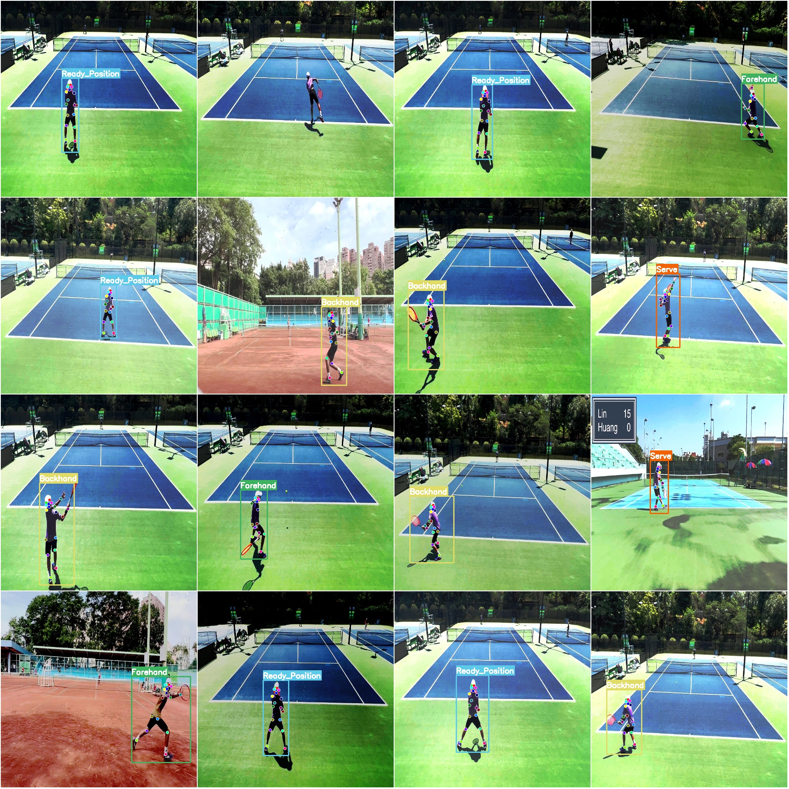

# Tennis Sports Action Detection Key Points Posture Estimation Test Dataset COCO + YOLO Format 4775 Images 4 Categories 18 Keypoints

Dataset format: YOLO keypoint format (Note this is not the target detection or segmentation YOLO format, only contains jpg images and corresponding .yolotxt files)  
Number of jpg files: 4775  
Number of annotated txt files: 4775  
Training set size: 4176  
Validation set size: 399  
Test set size: 200  
Number of annotated categories: 4  
Annotated category names: ['Backhand', 'Forehand', 'Ready_Position', 'Serve']  
Number of annotated keypoints: 18  
Keypoint names: ["nose", "left_eye", "right_eye", "left_ear", "right_ear", "left_shoulder", "right_shoulder", "left_elbow", "right_elbow", "left_wrist", "right_wrist", "left_hip", "right_hip", 
"left_knee", "right_knee", "left_ankle", "right_ankle", "neck"]  
Each category annotated box count:  
Backhand (forehand) box count = 1198  
Forehand (backhand) box count = 1199  
Ready_Position (ready position) box count = 1200  
Serve (serve) box count = 1178  
Total box count = 4775  
Image resolution: 1280x720  
Important note: The dataset has been divided into training, validation, and test sets, which can be directly used for training models with YOLOv5-pose, YOLOv8-pose, YOLOv11-pose, or YOLOv26-pose.  
Special declaration: This dataset does not guarantee the accuracy of the trained model or the weight files.  
Image preview:  
Annotation examples:  
Randomly selected 16 images:  
Annotation drawing results:

## Images

Here is a pay link on Stripe ( https://buy.stripe.com/3cs8yP7sY87d0vu9AB ). Please contact me lonlonago@foxmail.com after funding $89, and I will send you a complete data files , thank you!

